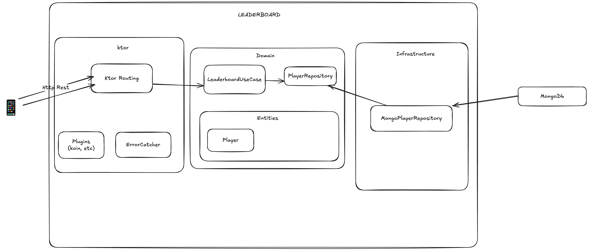

# leaderboard

## Disclaimers
- didn't touch kotlin since 2018 
- never used ktor before
- never used mongo before
- first time playing with Angular ([front end repository](https://github.com/alexduhem/leaderboard-front))

So I might not have the reflexes of an expert, please be indulgent 😇

## troubleshooting with JDK
I personally had issue when generating the ktor project with IntelliJ. (JDK issue)
That's why I set the Java version to v19 manually [here](https://github.com/alexduhem/leaderboard/blob/7ae6f7f6bee735671cae9a08c1658fc3d71e4e32/build.gradle.kts#L29), feel free to set what's working for you

## Postman collection
To help you test the API, you can find a JSON export of the POSTMAN collection [here](./Learderboard.postman_collection.json
)

## Deployment
- The API has been deployed on AppEngine, following the url https://betclic-leaderboard.ew.r.appspot.com/players
- The front end has been deployed on vercel : https://leaderboard-front-ashen.vercel.app/

## Architecture
I follow a well-known architecture with layers (hexagonal, onion, clean, you name it), 
the naming convention differ from one to another but the idea is the same : avoid strong dependency between component.

## Building & Running
You need to have docker compose installed (I guess you have it already), both for running and testing, the container
will be started automatically before (setup in gradle).

| Task             | Description                                                          |
|------------------|----------------------------------------------------------------------|
| `./gradlew test` | Run the tests                                                        |
| `./gradlew run`  | Build everything                                                     |

## Testing strategy
For this coding interview, I follow a more end-to-end testing strategy, with a real database (as I'm not an expert of Mongo, I prefer testing it instead of mocking it)
I didn't write any unit tests for the service layer, for a real project, I would also have mock repository and unit test layers independently, it depends.

I setup myself the docker container for the test database, I would consider using [testcontainers](https://testcontainers.com/) in a real project.

## Path to improvement
- no CI/CD setup, maybe overkill for a coding test
- not all the endpoint are well tested
- The GET /players does not return any rank for the players
- we could probably avoid 2 request to mongo when asking for the rank when getting a player, by using aggregate/windowfield, I didnt dig further for this test to avoid being in a big tunnel
